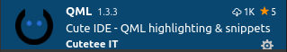

#Teil I - Prolog

##Installation

Wir werden nun anfangen und alle nötigen Programme installieren, um in der Lage zu sein, die gewünschte Software zu schreiben und sie auszuprobieren.  
Um Anwendungen auch auf anderen Platformen installieren zu können, werden wir zusätzliche Software im Kapitel über die Installation, später in diesem Buch, installieren.  

Ich gehe davon aus, das du bereits Python3 und Pip auf deinem Rechner installiert hast. Wenn nicht, findest du alle notwendigen Informationen auf der [Python](https://python.org) Webseite. Wir benötigen Python in der Version 3.8.10.   
Ich gehe ausserdem davon aus, dass du in der Lage bist Pakete mittels Pip zu installieren.  

Zuerst werden wir [PySide6] installieren, damit wir Desktop-GUI-Applikationen entwickeln können. 

```console
user@machine:/path$ pip install PySide6
```
Dann werden wir [Visual Studio Code](https://code.visualstudio.com/) installieren. VS-Code ist kostenlos und Open Source und hat viele nützliche Erweiterungen um Python Code schreiben zu können.  
Du kannst VS-Code [hier](https://code.visualstudio.com/Download) runterladen. Ich gehe davon aus, dass du in der Lage bist VS-Code selbständig zu installieren, ansonsten findest auf deren Webseite wunderbare Anleitungen.  
Du kannst auch **apt** nutzen, wenn du auf Linux bist.

```console
user@machine:/path$sudo add-apt-repository "deb [arch=amd64] https://packages.microsoft.com/repos/vscode stable main"
user@machine:/path$ sudo apt update
user@machine:/path$ sudo apt install code
```

Im Folgenden werden wir ein paar Erweiterungen installieren, um unsere erste Anwendung zu erstellen.   

##Entwicklungsumgebung Aufsetzen

Nachdem wir nun VS-Code installiert haben, installieren wir noch nachfolgende Erweiterungen.   

###Python

Python ist eine Erweiterung um Syntax farblich hervorzuheben, Python-Code zu debuggen und es enthält einen Linter.  
Manchmal zeigt es sogar die korrekte Intellisense an. Da ist wohl noch etwas Feinschliff an der Erweiterung zu machen.  


###Coderunner

Mit Coderunner bist du in der Lage, deine Anwendung mit nur einem Klick zu starten.     
  
Du must lediglich den "Play" Knopf klicken.  


###QML

QML ist nützlich um die Syntax für QML-Dateien einzufärben.   


###VS-Code Settings

Du kannst die Settings mit einem Klick auf das Icon mit dem Zahnrad öffnen.     
   
Und dann klickst du **"{}"** auf der oberen rechten Seite des Bildschirms um die Settings als JSON-Datei zu öffnen.     
  
Hier sind ein paar nützliche Einstellungen, welche ich in die *settings.json* eingefügt habe.  
Das colorTheme ist natürlich Geschackssache.  
Die Einstellung vom CoderRunner führt Python mit der *main.py* aus, egal welche Python-Datei gerade im Editor offen ist. Das bedingt natürlich, dass das Projekt eine Datei mit dem Namen *main.py* besitzt und das dies die Startdatei ist.

<div class="codehilite"><pre><span></span><code><span class="p">{</span>
    <span class="nt">&quot;workbench.colorTheme&quot;</span><span class="p">:</span> <span class="s2">&quot;Visual Studio Dark&quot;</span><span class="p">,</span>
    <span class="nt">&quot;code-runner.executorMap&quot;</span><span class="p">:</span> <span class="p">{</span>
        <span class="nt">&quot;python&quot;</span><span class="p">:</span> <span class="s2">&quot;python3 $workspaceRoot/main.py&quot;</span><span class="p">,</span>
    <span class="p">},</span>
    <span class="nt">&quot;code-runner.clearPreviousOutput&quot;</span><span class="p">:</span> <span class="kc">true</span><span class="p">,</span>
    <span class="nt">&quot;code-runner.saveAllFilesBeforeRun&quot;</span><span class="p">:</span> <span class="kc">true</span><span class="p">,</span>
    <span class="nt">&quot;git.autofetch&quot;</span><span class="p">:</span> <span class="kc">true</span><span class="p">,</span>
<span class="p">}</span>
</code></pre></div>

##Erste Anwendung

Wir schreiben nun eine simple Anwendung um unsere Umgebung einmal auszuprobieren.  
Ich gehe hier nicht weiter ins Detail, versuche aber später im Buch auf die Einzelheiten einzugehen.   

*basic.py*
```python
import sys
from PySide6.QtGui import QGuiApplication
from PySide6.QtQml import QQmlApplicationEngine

if __name__ == "__main__":
    app = QGuiApplication(sys.argv)
    engine = QQmlApplicationEngine("view.qml")
    if not engine.rootObjects():
        sys.exit(-1)
    sys.exit(app.exec())
```

*view.qml*
```qml
import QtQuick 2.0
import QtQuick.Controls 2.5

ApplicationWindow 
{
    width: 640
    height: 480
    visible: true
    title: "Simple"
}
```

In diesem Fall, da wir die Python Datei nicht *main.py* genannt haben, führen wir Python in einem Terminal innerhalb von VS-Code aus..  

```console
user@machine:/path$ python3 basic.py
```

  
  
In diesem Beispiel instanziieren wir eine Application, und laden das Userinterface aus der Datei *view.qml*.     

##Zusammenfassung

Nachdem wir die Entwicklungsumgebung aufgebaut haben, konnten wir die erste PySide6 Anwendung erstellen und ausführen. 
